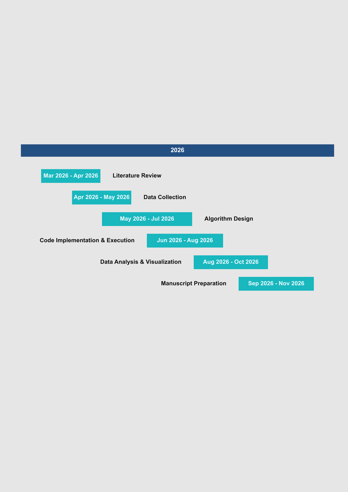
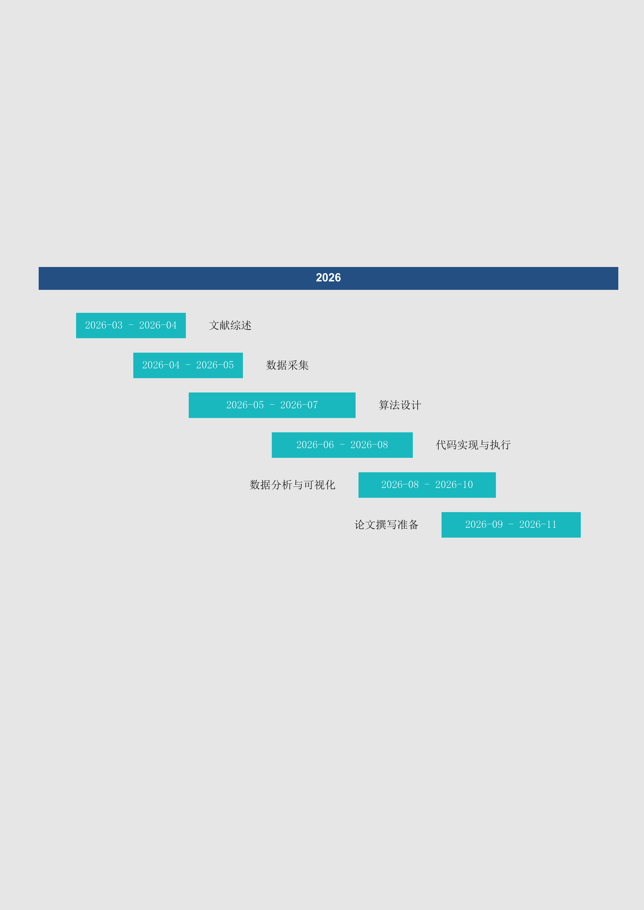

# Academic-Gantt：学术时间线甘特图工具

Academic-Gantt 用标准化模板（CSV/Markdown）生成学术风格甘特图。

## 项目特性

- A4 竖版输出
- 中文英文模板都支持
- 输出格式：`pdf/png/svg`

## 预览
<div align="center">
  
  
</div>

## 示例模板

| 英文模板 | 中文模板 |
|---|---|
| [data_template.md](data_template.md) / [data_template.csv](data_template.csv) | [data_template_zh.md](data_template_zh.md) / [data_template_zh.csv](data_template_zh.csv) |

## 环境准备（Conda）

```bash
# 1) 创建环境
conda create -n gantt python=3.11 -y

# 2) 激活环境
conda activate gantt

# 3) 安装依赖
pip install -r requirements.txt
```

## 一键运行

```bash
python main.py
```

默认为：

- 输入：`data_template.md`
- 输出：`output/academic_gantt.pdf`

## 常用命令

```bash
# 英文模板 -> PDF
python main.py --input data_template.md --output output/plan_en --format pdf

# 中文模板 -> PNG（默认 600 DPI）
python main.py --input data_template_zh.md --output output/plan_zh --format png

# 指定 PNG 分辨率（必须 >=300）
python main.py --input data_template_zh.csv --output output/plan_zh --format png --dpi 600
```

## DPI 规则

- `--dpi` 只对 `png` 生效，默认值为 `600`

## 字体安装说明（不通过 pip）

字体属于系统资源，不是 Python 包，因此不通过 `pip install` 安装。

- 英文优先：`Arial`
- 中文优先：`SimSun`（宋体）

Windows 安装：

1. 打开 `C:\Windows\Fonts`
2. 确认存在 `Arial` 和 `SimSun`
3. 若缺失，安装对应字体文件（`.ttf/.ttc`）

Linux 常见安装（中文）：

```bash
sudo apt update
sudo apt install -y fonts-noto-cjk
```

## 数据模板规范（已移除 Resource）

| 英文字段 | 中文字段 | 说明 |
|---|---|---|
| Task | 任务/任务名称 | 任务名称 |
| Start | 开始/开始日期 | 开始日期（YYYY-MM-DD） |
| End | 结束/结束日期 | 结束日期（YYYY-MM-DD） |
| Type | 类型/节点类型 | Task/任务 或 Milestone/里程碑 |

## 项目结构

```text
.
├── assets/
│   ├── readme_preview_en.png
│   └── readme_preview_zh.png
├── src/
│   ├── parser.py
│   ├── plotter.py
│   └── styles.py
├── data_template.md
├── data_template.csv
├── data_template_zh.md
├── data_template_zh.csv
├── main.py
├── requirements.txt
└── README.md
```

## 更新日志

### 2026-04-06

- 视觉风格调整为参考模板配色与布局
- 修复左侧长任务名称可能越界的问题（动态左边距）
- 数据模板移除 `Resource` 字段（中英 CSV/MD 全部同步）
- 保持 PNG 高分辨率导出规则（默认 600，最低 300）

