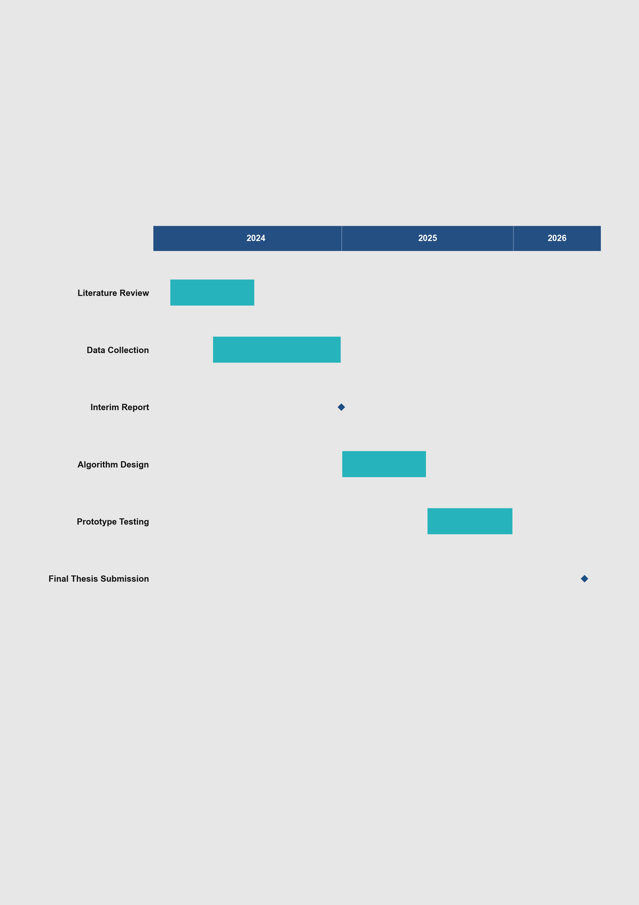

# Academic-Gantt：学术时间线甘特图工具

Academic-Gantt 是一个面向论文、课题和课程项目汇报的甘特图生成工具。
它的核心目标是：使用标准化数据模板，一条命令自动生成可用于论文/汇报的图表。

## 项目特性

- A4 竖版输出
- Arial 8 号（无 Arial 时回退 DejaVu Sans）
- 无标题、无图例、统一配色
- 支持里程碑（`Type=Milestone`）
- 支持输出 `pdf/png/svg`

## 预览



## 环境准备（Conda）

```bash
# 1) 创建环境
conda create -n gantt python=3.11 -y

# 2) 激活环境
conda activate gantt

# 3) 安装依赖
pip install -r requirements.txt
```

## 一键运行

```bash
python main.py
```

默认行为：

- 输入：`data_template.md`
- 输出：`output/academic_gantt.pdf`

## 常用命令

```bash
# 读取 Markdown 模板，导出 PDF
python main.py --input data_template.md --output output/my_plan --format pdf

# 读取 CSV，导出 PNG
python main.py --input data_template.csv --output output/my_plan --format png

# 导出 SVG
python main.py --input data_template.md --output output/my_plan --format svg
```

## 数据模板规范

| 字段 | 说明 | 示例 |
|---|---|---|
| Task | 任务名称 | Literature Review |
| Start | 开始日期（YYYY-MM-DD） | 2024-01-01 |
| End | 结束日期（YYYY-MM-DD） | 2024-12-31 |
| Type | Task 或 Milestone | Task |

根目录模板文件：

- `data_template.md`
- `data_template.csv`

## 项目结构

```text
.
├── assets/
│   └── readme_preview.png
├── src/
│   ├── parser.py
│   ├── plotter.py
│   └── styles.py
├── data_template.md
├── data_template.csv
├── main.py
├── requirements.txt
└── README.md
```

## 说明

- 配色灵感来源：PolyU 课程 `PROJECT LGI552_20252_A`
- 当前字段协议与命令行参数仍为英文，后续会补充中文适配
